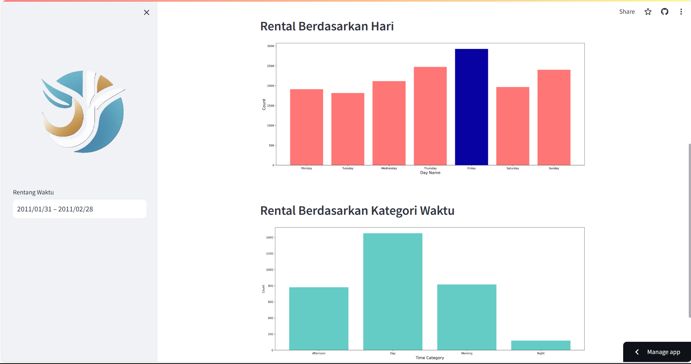

# Project-Data-Analisis-Dicoding
## Setup Environtment
```
conda create --name dt_analis python=3.9
conda activate dt_analis
pip install numpy pandas matplotlib seaborn jupyter streamlit
```
## Run Streamlit app 
```
streamlit run streamlit_dashboard.py
```

## Deploy App
Link Deploy : https://yeremiayospane-project-data-analisis-streamlit-dashboard-98g9j2.streamlit.app/

## Tampilan Dashboard : 
Berikut adalah tampilan dashboard.


